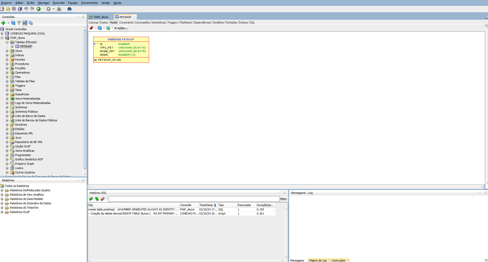

## 👨‍💻 Sobre o projeto

Pet Shop é uma aplicação simples no formato CRUD para desenvolver os conhecimentos relacionado a Python e Banco de dados usando as bibliotecas Pandas e OracleDB:

#### CRUD:

* Create (criar)
* Read (ler)
* Update (atualizar)
* Delete (excluir)
<br>

<br>


## 📄 Tecnologias

As seguintes tecnologias foram empregadas na criação deste projeto:

* [Python (v3.12.5)]: Uma linguagem de programação de alto nível, conhecida por sua sintaxe clara e facilidade de uso. Amplamente utilizada em diversas áreas, como desenvolvimento web, automação, ciência de dados e inteligência artificial.

* [os Python Standard Library]: Fornece funções para interagir com o sistema operacional, permitindo manipulação de arquivos, diretórios e variáveis de ambiente. É amplamente utilizada para tarefas como gerenciamento de processos e navegação no sistema de arquivos.

* [Pandas (v2.2.3)]: Uma poderosa biblioteca de análise de dados para Python, conhecida por sua eficiência e flexibilidade. Amplamente utilizada para manipulação e análise de dados estruturados, oferecendo estruturas de dados poderosas e operações otimizadas.

* [OracleDB (v2.4.1)]: Uma biblioteca de acesso a banco de dados Oracle para Python, facilitando a conexão e interação com bancos de dados Oracle. Oferece suporte robusto para consultas SQL, transações e gerenciamento de conexões.

## 📑 Banco de dados

* Necessário criar um banco de dados usando Oracle SQL Developer:



## 🚀 Como utilizar

Clone o projeto para o local desejado em seu computador.

```bash
git clone https://github.com/A1exLima/crud_pet_shop_oracle_db_python.git
```

## 🚧 Executando

Entre na pasta raiz do repositório

```PowerShell
#  Navega para o diretório do projeto no terminal.

cd crud_pet_shop_oracle_db_python
```

Execute os comandos:

```PowerShell
# Cria um ambiente virtual isolado para projetos Python, permitindo gerenciar dependências separadamente.

py -m venv venv
```

```PowerShell
# Ativa o ambiente virtual Python no Windows, permitindo usar suas dependências isoladas.

.\venv\Scripts\activate
```

```PowerShell
# Instala todas as dependências listadas no arquivo requirements.txt

pip install -r requirements.txt
```

Execute a aplicação localmente:

```PowerShell
# Executa o arquivo app.py usando o interpretador Python.

python app.py
```

___

<p align="center"> created by Alex Lima  - © 2024 - Todos os direitos reservados.<p align="center">
 <a href="https://www.linkedin.com/in/a1exlima/" target="_blank">
</p></p>

___
